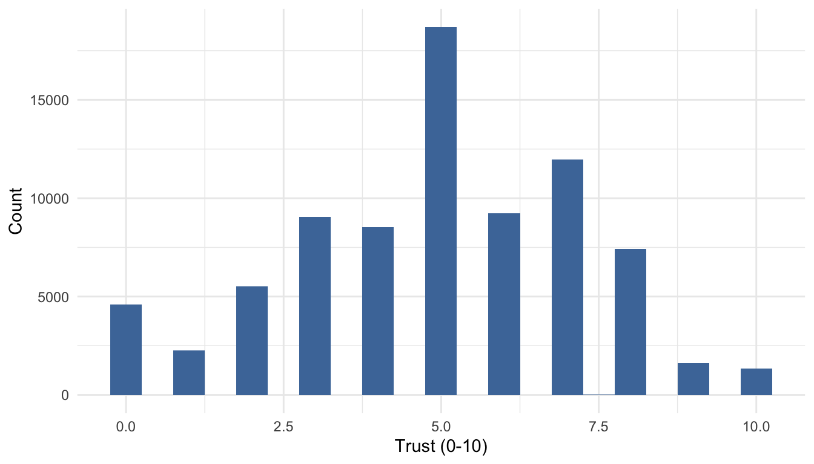
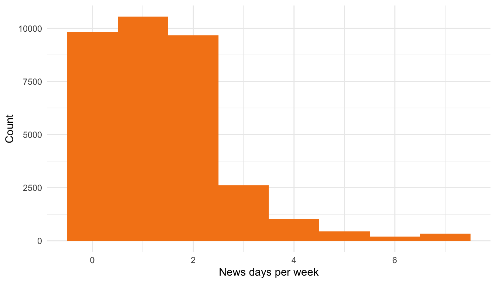
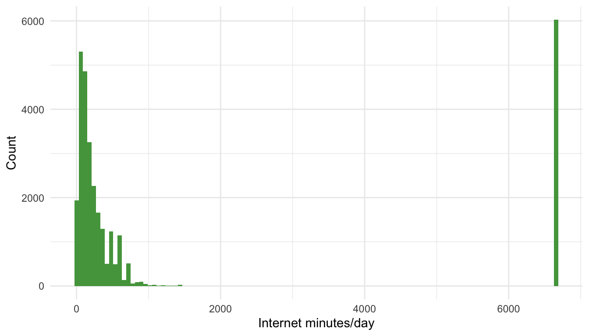
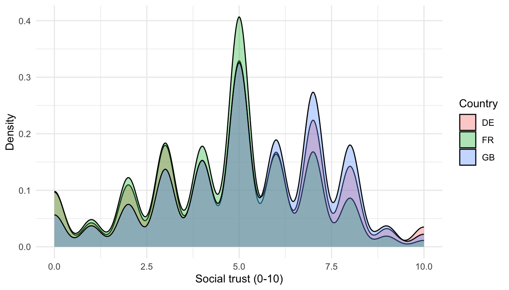
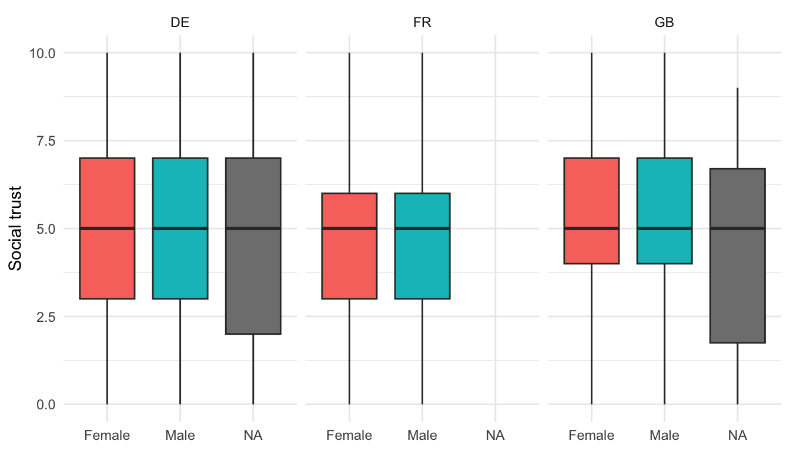
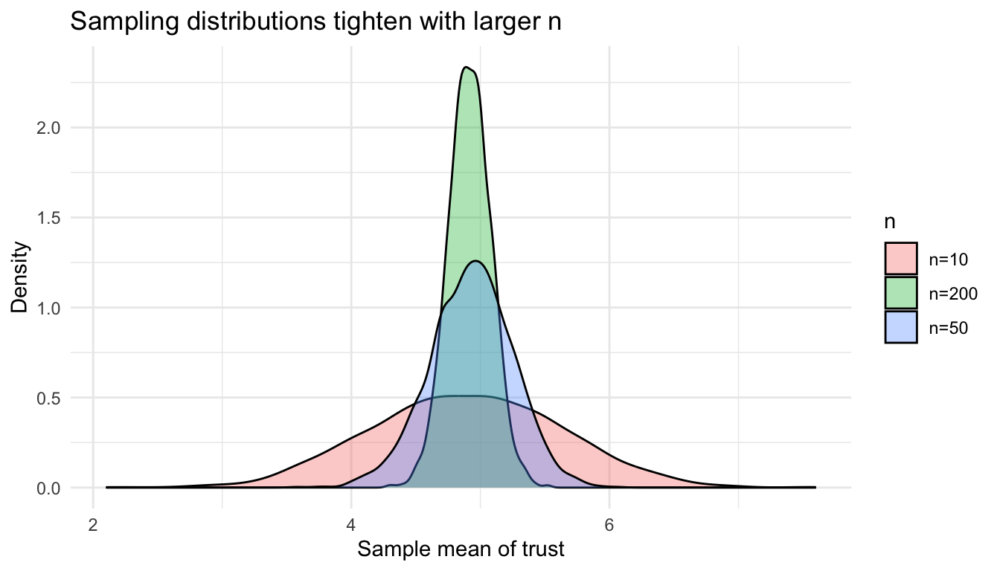

# Day 1 — Describing the ESS sample

Goal: practice measurement levels, univariate summaries, and basic visualisations using the ESS subset (GB, DE, FR). 


## Variables we use

- `ppltrst` (0–10): generalised social trust (higher = more trust)
- `agea`: age in years
- `gndr`: 1 = male, 2 = female (other codes = missing)
- `nwsptot`: days per week reading newspapers (0–7; 66/77/88/99 = missing)
- `netustm`: minutes per day on the internet
- `domicil`: 1 big city ... 5 farm/countryside
- `cntry`: GB, DE, FR

````r
library(dplyr)
library(ggplot2)

source("clean_ess.R")
ess <- clean_ess()
````

## Measurement checks

- `ppltrst` and `agea`: interval/ratio (mean and sd are fine).
- `nwsptot`, `netustm`: count-like; treat as interval for summaries but plot distributions.
- `domicil`: ordered categorical (use medians/percentiles).
- `gndr`: binary factor.

## From description to inference

- **Descriptive vs causal inference:** describing “what is” (population levels, group gaps) vs “why” (causal claims require design/identification). Today we stay descriptive but prep for causal thinking.
- **Sampling model:** estimates come from a sample → always uncertainty. Sampling distributions tell us how much an estimator would vary across repeated samples.
- **CLT intuition:** for many statistics (like the mean), repeated samples stack up in an approximately normal bell curve as *n* grows; this justifies SEs, CIs, and t-tests.
- **Hypothesis testing basics:** state H0/HA, pick a test statistic, get a p-value, draw a conclusion while minding Type I (false positive) and Type II (false negative) risks.

## Distributions and where centre matters

- **Central tendency:** use mean for roughly symmetric interval data (e.g., `ppltrst`), median for skewed or count-like data (e.g., `nwsptot`), and mode/proportions for categorical (`gndr`, `domicil`).
- **Shapes to look for:** symmetry vs. skew, heavy tails, spikes at 0, and multimodality. Use density/Histogram to diagnose before choosing a summary.
- **Robustness:** median and IQR resist outliers; mean and SD are more efficient when the distribution is near normal.

### Quick distribution gallery {.tabset}

#### Code


```r
ess <- clean_ess()
hist_trust <- ggplot(ess, aes(x = ppltrst)) + geom_histogram(binwidth = 0.5, fill = "#4C78A8") +
  labs(x = "Trust (0-10)", y = "Count") + theme_minimal()
hist_news  <- ggplot(ess, aes(x = nwsptot)) + geom_histogram(binwidth = 1, fill = "#F58518") +
  labs(x = "News days per week", y = "Count") + theme_minimal()
hist_net   <- ggplot(ess, aes(x = netustm)) + geom_histogram(binwidth = 60, fill = "#54A24B") +
  labs(x = "Internet minutes/day", y = "Count") + theme_minimal()
```

#### Output



## Problem set A — Univariate summaries

1. Compute mean, median, variance, and IQR for `ppltrst`, `nwsptot`, and `netustm` for each country.
2. Plot histograms (or density plots) of `ppltrst` by country; compare centres and spread.
3. Produce a table of counts and proportions for `gndr` and `domicil` by country.

### Worked example A {.tabset}

#### Code

````r
# code only (not executed in this tab)
summary_tbl <- ess |>
  group_by(cntry) |>
  summarise(
    trust_mean = mean(ppltrst, na.rm = TRUE),
    trust_sd   = sd(ppltrst, na.rm = TRUE),
    news_med   = median(nwsptot, na.rm = TRUE),
    news_iqr   = IQR(nwsptot, na.rm = TRUE),
    net_mean   = mean(netustm, na.rm = TRUE),
    net_sd     = sd(netustm, na.rm = TRUE)
  )

trust_plot <- ggplot(ess, aes(x = ppltrst, fill = cntry)) +
  geom_density(alpha = 0.35) +
  labs(x = "Social trust (0-10)", y = "Density", fill = "Country") +
  theme_minimal()

counts <- ess |>
  mutate(dom_group = factor(domicil, levels = 1:5,
                            labels = c("Big city","Suburbs","Town","Village","Farm"))) |>
  count(cntry, gender, dom_group, name = "n") |>
  group_by(cntry) |>
  mutate(prop = n / sum(n))
````

#### Output


```
## # A tibble: 3 × 7
##   cntry trust_mean trust_sd news_med news_iqr net_mean net_sd
##   <chr>      <dbl>    <dbl>    <dbl>    <dbl>    <dbl>  <dbl>
## 1 DE          4.90     2.40        1        1    1322.  2417.
## 2 FR          4.53     2.18        1        2    1754.  2771.
## 3 GB          5.31     2.22        1        2    1539.  2581.
```



```
## # A tibble: 43 × 5
## # Groups:   cntry [3]
##    cntry gender dom_group     n    prop
##    <chr> <chr>  <fct>     <int>   <dbl>
##  1 DE    Female Big city   3212 0.0872 
##  2 DE    Female Suburbs    2442 0.0663 
##  3 DE    Female Town       6723 0.182  
##  4 DE    Female Village    5354 0.145  
##  5 DE    Female Farm        391 0.0106 
##  6 DE    Female <NA>         86 0.00233
##  7 DE    Male   Big city   3144 0.0853 
##  8 DE    Male   Suburbs    2396 0.0650 
##  9 DE    Male   Town       6475 0.176  
## 10 DE    Male   Village    5739 0.156  
## # ℹ 33 more rows
```

## Problem set B — Bivariate exploration

1. Correlate `ppltrst` with `agea` overall and by country. Does trust rise or fall with age?
2. Create side-by-side boxplots of `ppltrst` by `gender` within each country.
3. Compute the difference in mean `ppltrst` between genders; provide 95% confidence intervals using a t-test.
4. Produce a country-by-gender table of median `nwsptot`.

### Worked example B {.tabset}

#### Code

````r
# code only (not executed in this tab)
cor_age_trust <- ess |>
  group_by(cntry) |>
  summarise(corr = cor(ppltrst, agea, use = "pairwise.complete.obs"))

boxplot_trust <- ggplot(ess, aes(x = gender, y = ppltrst, fill = gender)) +
  geom_boxplot(outlier.alpha = 0.2) +
  facet_wrap(~ cntry) +
  labs(x = NULL, y = "Social trust") +
  theme_minimal() +
  theme(legend.position = "none")

# difference in means with CI
trust_ttest <- t.test(ppltrst ~ gender, data = ess)
````

#### Output


```
## # A tibble: 3 × 2
##   cntry     corr
##   <chr>    <dbl>
## 1 DE     0.00129
## 2 FR    -0.0291 
## 3 GB     0.0782
```



```
## 
## 	Welch Two Sample t-test
## 
## data:  ppltrst by gender
## t = -6.3769, df = 79520, p-value = 1.817e-10
## alternative hypothesis: true difference in means between group Female and group Male is not equal to 0
## 95 percent confidence interval:
##  -0.13604975 -0.07207948
## sample estimates:
## mean in group Female   mean in group Male 
##             4.870032             4.974096
```

## Hypothesis testing quick-start

Two worked examples to introduce formal testing on Day 1.

### Example 1: Two-sample t-test (mean trust by gender) {.tabset}

#### Code

````r
t_gender <- t.test(ppltrst ~ gender, data = ess)
````

#### Output


```
## 
## 	Welch Two Sample t-test
## 
## data:  ppltrst by gender
## t = -6.3769, df = 79520, p-value = 1.817e-10
## alternative hypothesis: true difference in means between group Female and group Male is not equal to 0
## 95 percent confidence interval:
##  -0.13604975 -0.07207948
## sample estimates:
## mean in group Female   mean in group Male 
##             4.870032             4.974096
```

Interpretation: If the p-value < 0.05, we reject equal mean trust between men and women. The 95% CI shows the plausible range of the mean difference (Female − Male); if it excludes 0, the gap is statistically significant.

### Example 2: Chi-squared test (gender × regular news readership) {.tabset}

#### Code

````r
ess <- ess |>
  mutate(news_regular = ifelse(nwsptot >= 3 & !nwsptot %in% c(66,77,88,99), 1, 0))

tab_news <- table(ess$gender, ess$news_regular, useNA = "no")

chi_news <- chisq.test(tab_news)
````

#### Output


```
##         
##              0     1
##   Female 16142  2086
##   Male   13917  2532
```

```
## 
## 	Pearson's Chi-squared test with Yates' continuity correction
## 
## data:  tab_news
## X-squared = 116.47, df = 1, p-value < 2.2e-16
```

Interpretation: A small p-value means the share of regular news readers differs by gender (variables not independent). Report the chi-squared statistic, degrees of freedom, and p-value.


## Reflection prompts

- Which variables are most skewed? How does that affect your choice of centre and spread?
- Are gender gaps in trust consistent across GB, DE, and FR?
- If `nwsptot` has many zeros, is median more informative than mean?

Use these as warm-ups before moving into regression modeling in the next chapter.

## Sampling distributions by simulation

Central-limit intuition: as sample size grows, the sampling distribution of the mean tightens and approaches normality, even for skewed variables.

### Simulating sample means of trust {.tabset}

#### Code


```r
ess <- clean_ess()
set.seed(123)

draw_means <- function(var, n, reps = 2000) {
  vals <- na.omit(var)
  replicate(reps, mean(sample(vals, n, replace = TRUE)))
}

means_n10  <- draw_means(ess$ppltrst, n = 10)
means_n50  <- draw_means(ess$ppltrst, n = 50)
means_n200 <- draw_means(ess$ppltrst, n = 200)
```

#### Output



Interpretation: as n grows, the sampling distribution centers near the population mean and variance shrinks; this motivates using standard errors when reporting estimates.

## Hypothesis testing recap (slides → practice)

- **T-tests** compare means using the t distribution (fatter tails for small *n*); for two groups assume equal variances or use Welch when in doubt.
- **Chi-squared** tests independence in contingency tables.
- **Errors:** α = P(Type I), β = P(Type II); lowering α raises β. Report p-values *and* confidence intervals to show effect size and uncertainty.
- **Confidence intervals:** estimate ± (critical value × SE); if 95% CI excludes 0 (for mean differences), the two-sided test at α = 0.05 would reject H0.
