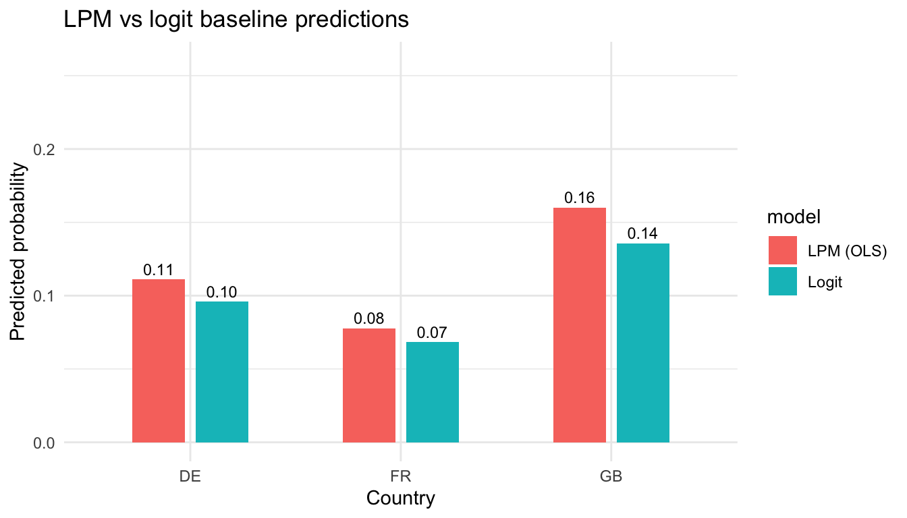
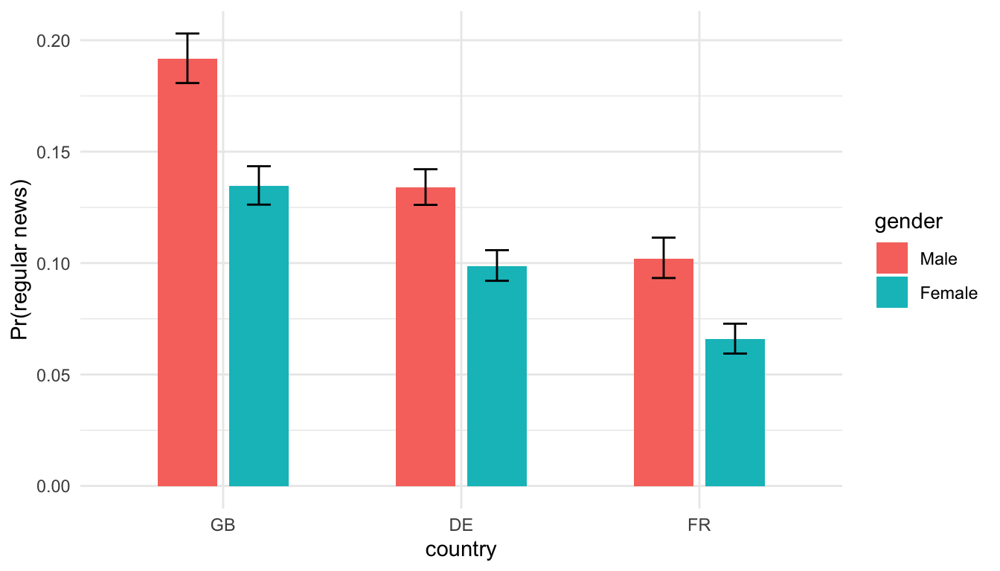
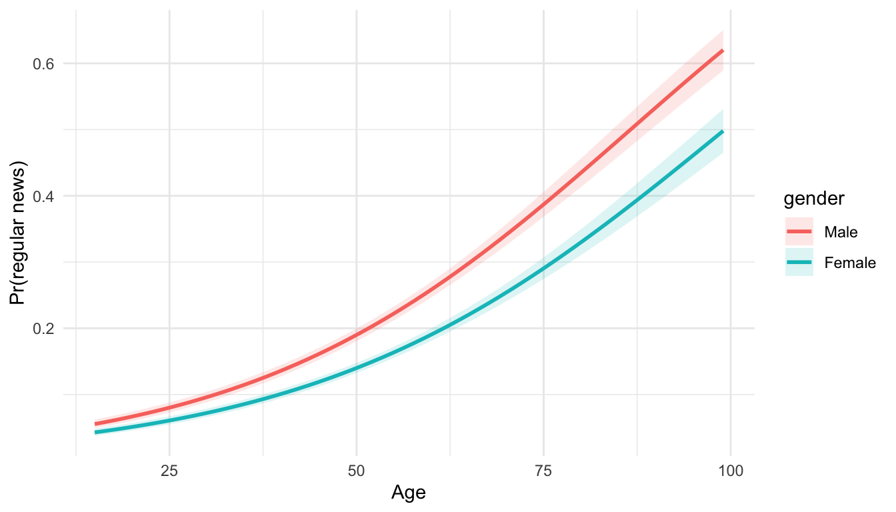
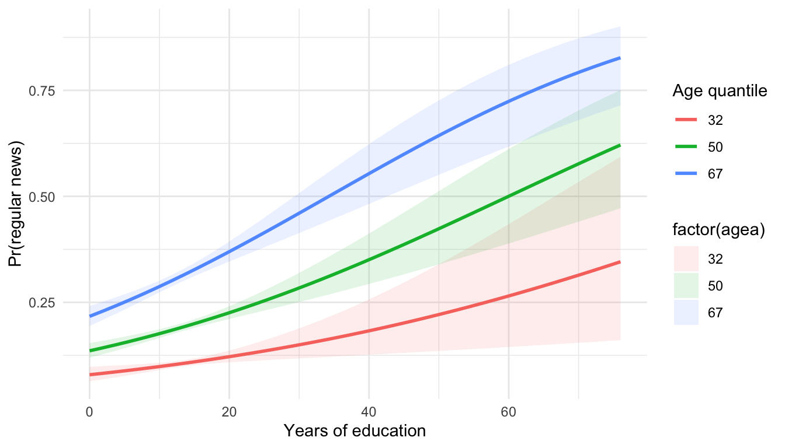
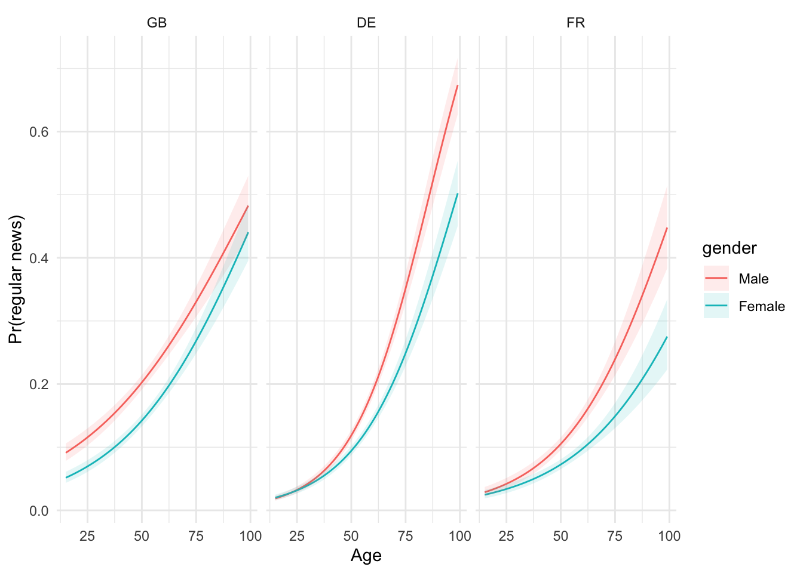
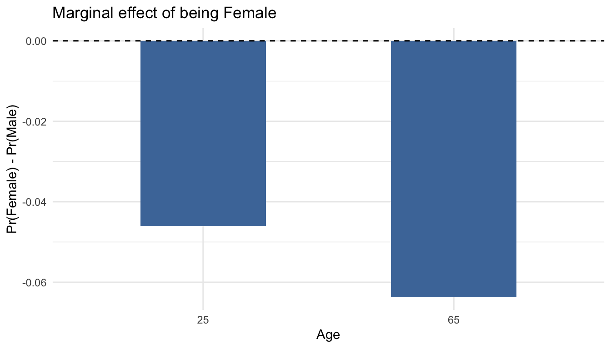

# Day 3 — Non-linear models: logistic regression

We now model binary outcomes. This replaces the old factor-analysis/PCA content and links three specifications:

- **Linear probability model (LPM):** \(Y_i \in \{0,1\},\ \mathbb{E}[Y_i\mid X_i]=X_i\beta\) (identity link).
- **Logit:** \(p_i = \Pr(Y_i=1\mid X_i)=\operatorname{logit}^{-1}(X_i\beta)=\frac{e^{X_i\beta}}{1+e^{X_i\beta}}\).
- **Marginal effects:** \(\frac{\partial p_i}{\partial x_{ik}} = p_i(1-p_i)\beta_k\), highlighting how effects vary with the baseline probability.
- **Interaction in logit:** For \(p_i = \operatorname{logit}^{-1}(\eta_i)\) with \(\eta_i = \beta_0 + \beta_1 x + \beta_2 z + \beta_3 xz\), the cross-partial effect is \( \frac{\partial^2 p_i}{\partial x\,\partial z} = p_i(1-p_i)(1-2p_i)\beta_1\beta_2 + p_i(1-p_i)\beta_3\); sign can vary with \(p_i\).

**Outcome**: `news_regular` = 1 if a respondent reads newspapers on at least 3 days per week (`nwsptot >= 3`), 0 otherwise.

**Predictors**: age (`agea`), gender (`gndr`), country (`cntry`), education (`eduyrs`), and their interactions.


```r
library(dplyr)
library(broom)
library(ggplot2)

source("R/clean_ess.R")

ess <- clean_ess()

# Fit once and reuse
lpm1   <- lm(news_regular ~ agea + gender + country, data = ess)
logit1 <- glm(news_regular ~ agea + gender + country, data = ess, family = binomial())
logit2 <- glm(news_regular ~ gender * country + agea, data = ess, family = binomial())
logit3 <- glm(news_regular ~ gender * agea + country + eduyrs, data = ess, family = binomial())
logit4 <- glm(news_regular ~ agea * eduyrs + gender + country, data = ess, family = binomial())
logit5 <- glm(news_regular ~ gender * agea * country + eduyrs, data = ess, family = binomial())

# Prediction data for plots
age_seq <- seq(min(ess$agea, na.rm = TRUE), max(ess$agea, na.rm = TRUE), length.out = 60)
edu_seq <- seq(min(ess$eduyrs, na.rm = TRUE), max(ess$eduyrs, na.rm = TRUE), length.out = 40)

nd2 <- expand.grid(country = c("GB","DE","FR"),
                   gender = c("Male","Female"),
                   agea = mean(ess$agea, na.rm = TRUE))
pred2 <- predict(logit2, newdata = nd2, type = "link", se.fit = TRUE)
nd2$pr <- plogis(pred2$fit)
nd2$lo <- plogis(pred2$fit - 1.96 * pred2$se.fit)
nd2$hi <- plogis(pred2$fit + 1.96 * pred2$se.fit)
plot_gender_country <- ggplot(nd2, aes(x = country, y = pr, fill = gender)) +
  geom_col(position = position_dodge(width = 0.6), width = 0.5) +
  geom_errorbar(aes(ymin = lo, ymax = hi), position = position_dodge(width = 0.6), width = 0.2) +
  labs(y = "Pr(regular news)") +
  theme_minimal()

nd3 <- expand.grid(agea = age_seq, gender = c("Male","Female"),
                   country = "GB", eduyrs = mean(ess$eduyrs, na.rm = TRUE))
pred3 <- predict(logit3, newdata = nd3, type = "link", se.fit = TRUE)
nd3$pr <- plogis(pred3$fit)
nd3$lo <- plogis(pred3$fit - 1.96 * pred3$se.fit)
nd3$hi <- plogis(pred3$fit + 1.96 * pred3$se.fit)
plot_gender_age <- ggplot(nd3, aes(x = agea, y = pr, color = gender)) +
  geom_line(size = 1) +
  geom_ribbon(aes(ymin = lo, ymax = hi, fill = gender), alpha = 0.15, color = NA) +
  labs(y = "Pr(regular news)", x = "Age") +
  theme_minimal()

nd4 <- expand.grid(eduyrs = edu_seq,
                   agea = quantile(ess$agea, c(.2,.5,.8), na.rm = TRUE),
                   gender = "Male", country = "GB")
pred4 <- predict(logit4, newdata = nd4, type = "link", se.fit = TRUE)
nd4$pr <- plogis(pred4$fit)
nd4$lo <- plogis(pred4$fit - 1.96 * pred4$se.fit)
nd4$hi <- plogis(pred4$fit + 1.96 * pred4$se.fit)
plot_age_edu <- ggplot(nd4, aes(x = eduyrs, y = pr, color = factor(agea))) +
  geom_line(size = 1) +
  geom_ribbon(aes(ymin = lo, ymax = hi, fill = factor(agea)), alpha = 0.12, color = NA) +
  labs(y = "Pr(regular news)", x = "Years of education", color = "Age quantile") +
  theme_minimal()

nd5 <- expand.grid(agea = age_seq,
                   gender = c("Male","Female"),
                   country = c("GB","DE","FR"),
                   eduyrs = mean(ess$eduyrs, na.rm = TRUE))
pred5 <- predict(logit5, newdata = nd5, type = "link", se.fit = TRUE)
nd5$pr <- plogis(pred5$fit)
nd5$lo <- plogis(pred5$fit - 1.96 * pred5$se.fit)
nd5$hi <- plogis(pred5$fit + 1.96 * pred5$se.fit)
plot_threeway <- ggplot(nd5, aes(x = agea, y = pr, color = gender)) +
  geom_line() +
  geom_ribbon(aes(ymin = lo, ymax = hi, fill = gender), alpha = 0.12, color = NA) +
  facet_wrap(~ country) +
  labs(y = "Pr(regular news)", x = "Age") +
  theme_minimal()

# Average marginal effects (finite-difference, no parallelism)
calc_ame <- function(model, data, var, step = 1) {
  data_hi <- data
  if (is.numeric(data_hi[[var]])) {
    data_hi[[var]] <- data_hi[[var]] + step
  } else if (is.factor(data_hi[[var]]) || is.character(data_hi[[var]])) {
    # flip binary factor
    if (all(na.omit(unique(data_hi[[var]])) %in% c("Male","Female"))) {
      data_hi[[var]] <- ifelse(data_hi[[var]] == "Female", "Male", "Female")
    }
  }
  p_hi <- predict(model, newdata = data_hi, type = "response")
  p_lo <- predict(model, newdata = data, type = "response")
  mean(p_hi - p_lo, na.rm = TRUE)
}
ame_age  <- calc_ame(logit5, ess, "agea", step = 1)
ame_fem  <- calc_ame(logit5, ess, "gender", step = 0)  # Female vs Male switch
ame_table <- tibble(
  variable = c("agea (+1 year)", "gender (Female vs Male)"),
  AME = c(ame_age, ame_fem)
)

# Marginal effect of being Female at age 25 vs 65
nd_female <- data.frame(agea = c(25,65),
                        gender = "Female",
                        country = "GB",
                        eduyrs = mean(ess$eduyrs, na.rm = TRUE))
nd_male   <- nd_female; nd_male$gender <- "Male"
pred_f <- predict(logit5, newdata = nd_female, type = "response")
pred_m <- predict(logit5, newdata = nd_male,   type = "response")
me_female_diff <- data.frame(agea = c(25,65),
                             diff = pred_f - pred_m)
me_female_plot <- ggplot(me_female_diff, aes(x = factor(agea), y = diff)) +
  geom_col(fill = "#4C78A8", width = 0.5) +
  geom_hline(yintercept = 0, linetype = "dashed") +
  labs(x = "Age", y = "Pr(Female) - Pr(Male)", title = "Marginal effect of being Female") +
  theme_minimal()
```

## 0. Linear probability model (LPM) first

- **Specification:** \(Y_i = X_i\beta + \varepsilon_i,\ Y_i \in \{0,1\}\). Ordinary least squares with a binary outcome.
- **Pros:** Coefficients are immediate probability changes (\(\Delta p\)) per unit of \(X\); easy to interpret and to add fixed effects.
- **Cons:** Predicted values can leave \([0,1]\); errors are heteroskedastic; marginal effects are assumed constant even when baseline risk is near 0 or 1.
- **When is LPM “safe enough”?** Middle-range probabilities (e.g., 0.2–0.8), modest leverage points, and when the goal is fast descriptive decomposition or fixed-effects absorption. Use robust standard errors.


```r
library(sandwich)
library(lmtest)

lpm_vcov <- sandwich::vcovHC(lpm1, type = "HC1")
lpm_tidy <- broom::tidy(lpm1, conf.int = TRUE, vcov = lpm_vcov)
```

#### Output


```
## # A tibble: 5 × 7
##   term        estimate std.error statistic  p.value conf.low conf.high
##   <chr>          <dbl>     <dbl>     <dbl>    <dbl>    <dbl>     <dbl>
## 1 (Intercept) -0.0861  0.00569      -15.1  1.43e-51 -0.0973   -0.0750 
## 2 agea         0.00397 0.0000969     40.9  0         0.00378   0.00416
## 3 genderMale   0.0429  0.00356       12.0  2.31e-33  0.0359    0.0498 
## 4 countryFR   -0.0334  0.00442       -7.56 4.08e-14 -0.0421   -0.0248 
## 5 countryGB    0.0490  0.00418       11.7  9.41e-32  0.0408    0.0572
```

#### LPM vs logit predictions



Observation: If LPM bars stray above 1 or below 0, that signals the need for a logit/probit link. Here the mid-range outcome keeps LPM close, but we switch to logit next for coherent probabilities and curved marginal effects.

## 1. Simple logistic model
### Simple logistic model {.tabset}

#### Code


```r
logit1 <- glm(news_regular ~ agea + gender + country, data = ess, family = binomial())
broom::tidy(logit1, exponentiate = TRUE, conf.int = TRUE)
```

Odds ratios > 1 indicate higher odds of being a regular news reader.

#### Output


```
## # A tibble: 5 × 7
##   term        estimate std.error statistic  p.value conf.low conf.high
##   <chr>          <dbl>     <dbl>     <dbl>    <dbl>    <dbl>     <dbl>
## 1 (Intercept)   0.0175  0.0624      -64.9  0          0.0155    0.0197
## 2 agea          1.04    0.000941     38.5  0          1.04      1.04  
## 3 genderMale    1.50    0.0330       12.2  3.33e-34   1.40      1.60  
## 4 countryFR     0.692   0.0452       -8.16 3.34e-16   0.633     0.755 
## 5 countryGB     1.48    0.0367       10.7  9.12e-27   1.38      1.59
```
Interpretation: Odds ratios >1 raise the chance of regular news use; check if the CI excludes 1 for age, gender, or specific countries before claiming significance.

## 2. Binary × Binary interaction (gender × country) {.tabset}

#### Code


```r
logit2 <- glm(news_regular ~ gender * country + agea, data = ess, family = binomial())
plot_gender_country <- ggplot(nd2, aes(x = country, y = pr, fill = gender)) +
  geom_col(position = position_dodge(width = 0.6), width = 0.5) +
  labs(y = "Pr(regular news)") +
  theme_minimal()
```

#### Output


```
## # A tibble: 7 × 7
##   term                 estimate std.error statistic  p.value conf.low conf.high
##   <chr>                   <dbl>     <dbl>     <dbl>    <dbl>    <dbl>     <dbl>
## 1 (Intercept)            0.0180  0.0662      -60.7  0          0.0158    0.0205
## 2 genderMale             1.41    0.0522        6.61 3.83e-11   1.27      1.56  
## 3 countryFR              0.643   0.0673       -6.57 5.14e-11   0.563     0.733 
## 4 countryGB              1.42    0.0536        6.55 5.87e-11   1.28      1.58  
## 5 agea                   1.04    0.000941     38.5  0          1.04      1.04  
## 6 genderMale:countryFR   1.14    0.0907        1.47 1.42e- 1   0.957     1.37  
## 7 genderMale:countryGB   1.08    0.0735        1.04 2.97e- 1   0.935     1.25
```


Interpretation: If male–female bars overlap within countries (CI bars), gender differences are modest. Compare across countries to see where the gap is largest.

## 3. Binary × Continuous interaction (gender × age) {.tabset}

#### Code


```r
logit3 <- glm(news_regular ~ gender * agea + country + eduyrs, data = ess, family = binomial())
plot_gender_age <- ggplot(nd3, aes(x = agea, y = pr, color = gender)) +
  geom_line(size = 1) +
  labs(y = "Pr(regular news)", x = "Age") +
  theme_minimal()
```

#### Output


```
## # A tibble: 7 × 7
##   term            estimate std.error statistic   p.value conf.low conf.high
##   <chr>              <dbl>     <dbl>     <dbl>     <dbl>    <dbl>     <dbl>
## 1 (Intercept)       0.0109   0.114      -39.6  0          0.00868    0.0136
## 2 genderMale        1.26     0.113        2.03 4.22e-  2  1.01       1.57  
## 3 agea              1.04     0.00141     26.2  1.61e-151  1.03       1.04  
## 4 countryFR         0.733    0.0460      -6.76 1.34e- 11  0.669      0.802 
## 5 countryGB         1.51     0.0370      11.2  3.74e- 29  1.41       1.63  
## 6 eduyrs            1.03     0.00450      7.45 9.68e- 14  1.02       1.04  
## 7 genderMale:agea   1.00     0.00192      1.41 1.58e-  1  0.999      1.01
```


Interpretation: Diverging ribbons indicate age effects differ by gender; if both ribbons rise similarly, the interaction is weak.

## 4. Continuous × Continuous interaction (age × education) {.tabset}

#### Code


```r
logit4 <- glm(news_regular ~ agea * eduyrs + gender + country, data = ess, family = binomial())
plot_age_edu <- ggplot(nd4, aes(x = eduyrs, y = pr, color = factor(agea))) +
  geom_line(size = 1) +
  labs(y = "Pr(regular news)", x = "Years of education", color = "Age quantile") +
  theme_minimal()
```

#### Output


```
## # A tibble: 7 × 7
##   term        estimate std.error statistic  p.value conf.low conf.high
##   <chr>          <dbl>     <dbl>     <dbl>    <dbl>    <dbl>     <dbl>
## 1 (Intercept)   0.0133  0.223      -19.4   1.12e-83  0.00860    0.0206
## 2 agea          1.03    0.00353      9.47  2.80e-21  1.03       1.04  
## 3 eduyrs        1.01    0.0162       0.707 4.80e- 1  0.980      1.04  
## 4 genderMale    1.46    0.0334      11.4   6.41e-30  1.37       1.56  
## 5 countryFR     0.737   0.0461      -6.63  3.29e-11  0.673      0.806 
## 6 countryGB     1.52    0.0370      11.2   2.53e-29  1.41       1.63  
## 7 agea:eduyrs   1.00    0.000270     1.44  1.50e- 1  1.00       1.00
```


Interpretation: Steeper lines for higher age quantiles would mean education matters more (or less) for older respondents; overlap implies limited moderation.

## 5. Three-way interaction (gender × age × country) {.tabset}

#### Code


```r
logit5 <- glm(news_regular ~ gender * agea * country + eduyrs, data = ess, family = binomial())
plot_threeway <- ggplot(nd5, aes(x = agea, y = pr, color = gender)) +
  geom_line() +
  facet_wrap(~ country) +
  labs(y = "Pr(regular news)", x = "Age") +
  theme_minimal()
```

#### Output


```
## # A tibble: 13 × 7
##    term                estimate std.error statistic   p.value conf.low conf.high
##    <chr>                  <dbl>     <dbl>     <dbl>     <dbl>    <dbl>     <dbl>
##  1 (Intercept)          0.00660   0.164     -30.7   2.20e-206  0.00477   0.00907
##  2 genderMale           0.809     0.203      -1.04  2.97e-  1  0.543     1.20   
##  3 agea                 1.05      0.00240    19.3   6.67e- 83  1.04      1.05   
##  4 countryFR            1.52      0.232       1.82  6.91e-  2  0.965     2.40   
##  5 countryGB            3.30      0.187       6.38  1.73e- 10  2.29      4.76   
##  6 eduyrs               1.03      0.00452     7.28  3.30e- 13  1.02      1.04   
##  7 genderMale:agea      1.01      0.00336     2.79  5.33e-  3  1.00      1.02   
##  8 genderMale:country…  1.29      0.324       0.793 4.28e-  1  0.685     2.44   
##  9 genderMale:country…  2.46      0.260       3.46  5.37e-  4  1.48      4.10   
## 10 agea:countryFR       0.986     0.00387    -3.66  2.57e-  4  0.979     0.993  
## 11 agea:countryGB       0.986     0.00311    -4.69  2.77e-  6  0.980     0.992  
## 12 genderMale:agea:co…  0.998     0.00542    -0.400 6.89e-  1  0.987     1.01   
## 13 genderMale:agea:co…  0.985     0.00438    -3.34  8.46e-  4  0.977     0.994
```


Interpretation: Scan each country facet—if ribbons separate widely, the age–gender pattern is country-specific; overlapping ribbons suggest similar patterns across countries.

## 6. Marginal effects and interpretation

````r
# Average marginal effects for age within each country
ame_age <- marginaleffects(logit5, variables = "agea", by = "country")

# Marginal effect of being Female at age 25 vs age 65
me_female_age <- marginaleffects(logit5, variables = "gender", newdata = datagrid(agea = c(25, 65)))
````

- Prefer predicted probabilities and marginal effects over raw log-odds.
- Inspect separation or influential points with `performance::check_model(logit5)` if desired.

### AMEs and focal contrasts {.tabset}

#### Code


```r
ame_table <- tibble(
  variable = c("agea (+1 year)", "gender (Female vs Male)"),
  AME = c(ame_age, ame_fem)
)

me_female_diff <- data.frame(agea = c(25,65), diff = pred_f - pred_m)  # from fits chunk
```

#### Output


```
## # A tibble: 2 × 2
##   variable                    AME
##   <chr>                     <dbl>
## 1 agea (+1 year)          0.00451
## 2 gender (Female vs Male) 0.00237
```



Interpretation: The AME for age reports the average change in the probability of regular news use for a one-year increase in age. The bar chart shows how the female–male gap differs at ages 25 vs 65; positive bars mean higher probability for women at that age.

Country-level pooling choices (fixed vs multilevel) are expanded in the next chapter.

## Problem set — Logistic regression practice

1. Recode the outcome as `news_daily = nwsptot >= 5` and re-estimate `logit3`. How do the marginal effects of age change when the bar for “regular” consumption is higher?
2. Add `urban` (1/2 = urban, 3–5 = non-urban) as a predictor and interact it with `country`. Which country shows the largest urban–rural gap in news readership?
3. Compare `logit4` and `logit5` using AIC and pseudo R² (`pscl::pR2`). Which balance of complexity and fit seems reasonable for classroom examples?
4. For one model, translate results into plain language for a non-technical audience: choose two profiles (e.g., 30-year-old woman in GB vs 60-year-old man in FR) and report predicted probabilities.

These exercises deliver a full set of interaction types in a nonlinear setting, ready to complement your lecture slides.
