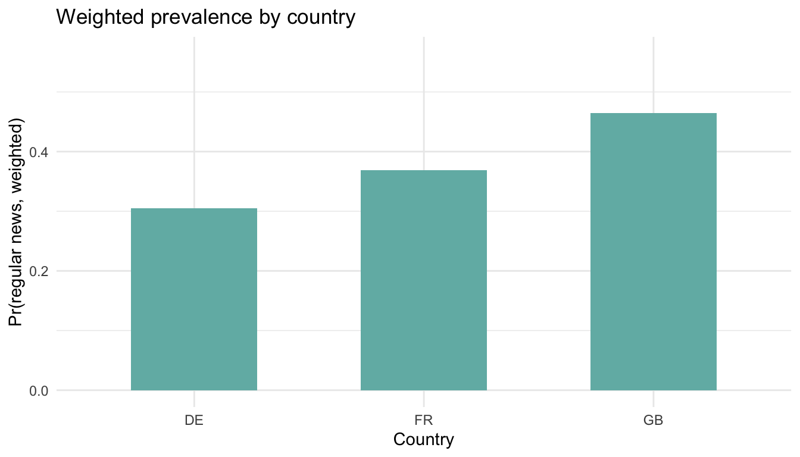

# Survey weighting — why and how

Survey data are collected with unequal selection probabilities. Inference should reflect the design to avoid biased point estimates and standard errors.

- **Notation:** Let \(w_i = 1/\pi_i\) be the design (inverse-probability) weight. For a finite population mean \(\bar{Y} = \sum_i w_i Y_i / \sum_i w_i\). For regression, weighted likelihoods re-scale each case by \(w_i\).
- **ESS fields used:** `pweight` (post-stratification weight), `psu` (primary sampling unit), `stratum` (strata). We set `options(survey.lonely.psu = "adjust")` to stabilize single-PSU strata.

### What these design variables mean (plain language)

- **`pweight` (post-stratification weight):** Adjusts for unequal inclusion probabilities *and* aligns the achieved sample with known population margins (e.g., age × gender × region). Large `pweight` values upweight under-represented respondents; small values downweight over-represented ones.
- **`psu` (primary sampling unit):** The first cluster stage of selection (e.g., municipalities or postcode sectors). Respondents inside the same PSU share fieldwork and selection features, so their responses are correlated.
- **`stratum` (strata):** Mutually exclusive groups within which PSUs were sampled (e.g., by region × urbanicity). Stratification improves precision; variance estimation must respect it.
- **Design degrees of freedom:** With clustering and stratification, the effective df are closer to the number of PSUs minus strata, not the raw respondent count—hence the importance of design-aware SEs.


```r
library(dplyr)
library(ggplot2)
library(tidyr)
library(survey)
library(broom)

# Synthetic microdata to illustrate weighting without depending on raw ESS file quirks
set.seed(42)
n_psu <- 120
n_by_psu <- sample(8:18, n_psu, replace = TRUE)

demo_psu <- tibble(
  psu = 1:n_psu,
  stratum = sample(1:20, n_psu, replace = TRUE),
  country = sample(c("GB", "DE", "FR"), n_psu, replace = TRUE, prob = c(.4, .35, .25)),
  pweight = runif(n_psu, 0.5, 3),
  n = n_by_psu
)

ess_w <- demo_psu |>
  uncount(n) |>
  mutate(
    agea = round(rnorm(n(), 50, 15)),
    gender = sample(c("Male", "Female"), n(), replace = TRUE),
    # Generate outcome with country- and age-dependent probability
    linpred = -1 + 0.6 * (country == "GB") + 0.3 * (country == "FR") +
              0.01 * (agea - 50) + 0.4 * (gender == "Female"),
    news_regular = rbinom(n(), 1, plogis(linpred))
  ) |>
  select(psu, stratum, country, pweight, agea, gender, news_regular) |>
  mutate(country = factor(country),
         gender = factor(gender))

options(survey.lonely.psu = "adjust")
des <- svydesign(ids = ~psu, strata = ~stratum, weights = ~pweight,
                 data = ess_w, nest = TRUE)

svy_n <- nrow(des$variables)
```

## 1. Weighted descriptive estimates

Sample used after complete-case filtering: 1556 respondents.


```r
svymean(~news_regular, des)
```

```
##                 mean     SE
## news_regular 0.38522 0.0153
```

- The point estimate is the **design-weighted mean**; SEs account for clustering and stratification.
- **Design effect** (`svymean(..., deff=TRUE)`) tells how much variance inflation comes from the design versus SRS.

### Country-weighted proportions



## 2. Weighted regression: linear probability and logit


```r
lpm_w <- svyglm(news_regular ~ agea + gender + country,
                design = des, family = gaussian())
tidy(lpm_w)
```

```
## # A tibble: 5 × 5
##   term        estimate std.error statistic     p.value
##   <chr>          <dbl>     <dbl>     <dbl>       <dbl>
## 1 (Intercept)  0.240    0.0493        4.86 0.00000453 
## 2 agea         0.00214  0.000781      2.74 0.00741    
## 3 genderMale  -0.0875   0.0243       -3.60 0.000509   
## 4 countryFR    0.0679   0.0390        1.74 0.0851     
## 5 countryGB    0.155    0.0276        5.61 0.000000193
```


```r
logit_w <- svyglm(news_regular ~ agea + gender + country,
                  design = des, family = quasibinomial())
tidy(logit_w, exponentiate = TRUE)
```

```
## # A tibble: 5 × 5
##   term        estimate std.error statistic     p.value
##   <chr>          <dbl>     <dbl>     <dbl>       <dbl>
## 1 (Intercept)    0.327   0.221       -5.06 0.00000204 
## 2 agea           1.01    0.00346      2.69 0.00833    
## 3 genderMale     0.683   0.105       -3.64 0.000446   
## 4 countryFR      1.36    0.174        1.76 0.0815     
## 5 countryGB      1.95    0.122        5.48 0.000000335
```

Comparison points for students:

- **Weights + clustering**: `svyglm` gives design-consistent SEs; plain `glm` does not.
- **Quasibinomial** keeps logit link but uses robust variance; estimates mirror survey-weighted MLE when weights are scaled.
- **LPM vs logit under weights**: LPM slopes stay probability-difference interpretation; logit ORs remain multiplicative.

## 3. When to weight (practical guidance)

- Use design/post-strat weights when estimating **population levels** (means, totals, prevalence) or effects that might shift with differential selection.
- In randomized experiments or when modeling **causal effects with ignorable sampling**, weights may be optional; still cluster-robust SEs matter.
- If the research question is **sample-only prediction**, weights can be skipped, but report that scope-of-inference is limited.

## 4. Small worked example: weighted marginal effect of age


## Practice prompts

1. Recompute weighted country gaps using `anweight` instead of `pweight`. How do the estimates move?
2. Add education to the weighted logit. Do ORs shift relative to the unweighted model in Chapter 5?
3. Estimate a design effect for `news_regular` and discuss how many “effective” observations the design corresponds to.
